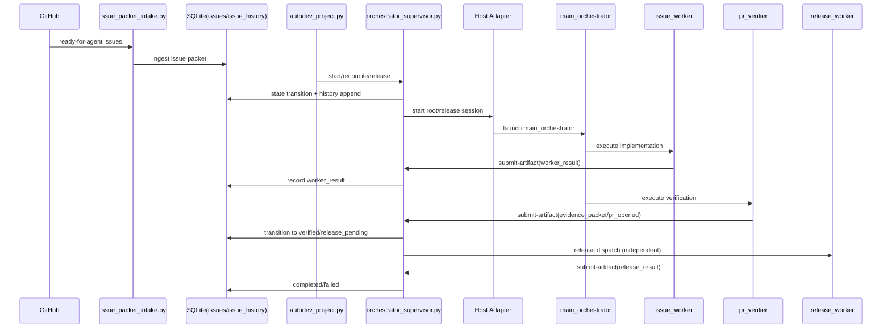

# autodev 系統架構說明（DB-only control plane）

> 本文件整理目前 `db-only-control-plane` 分支的系統架構、資料流、命令參數、環境變數、持續自動開發與 release 設定。內容以 `scripts/` 與 `docs/agents/runtime/*` 現況為準。

## 1. 架構總覽

`autodev` 在 `db-only-control-plane` 分支採用 **SQLite DB-only control plane**：

- Runtime truth 只在 `.opencode/runtime/control-plane.sqlite3`
- 核心資料表只有 `issues` 與 `issue_history`
- 新 issue 的唯一可選狀態為 `ready`
- 同一 issue 不可重複啟動；不同 issue 可在容量內並行
- per-issue 開發流程到 `verified`，release 由獨立 `release_worker` 路徑處理

主要入口腳本：

- Wrapper 層：`scripts/autodev_project.py`（`--project-root`）
- Core 層：`scripts/orchestrator_supervisor.py`（`--base-dir`）
- Bootstrap wrapper：`scripts/orchestrator_bootstrap_runner.py`
- Intake：`scripts/issue_packet_intake.py`

## 2. 架構圖（Architecture Diagram）

```mermaid
flowchart LR
  GH[GitHub Issues/PRs]
  OP[Operator Commands]
  AP[autodev_project.py]
  SUP[orchestrator_supervisor.py]
  BOOT[orchestrator_bootstrap_runner.py]
  INTAKE[issue_packet_intake.py]
  DB[(SQLite: issues + issue_history)]
  HOST[Host Adapter\n(OpenCode default)]
  ROOT[main_orchestrator]
  WORKER[issue_worker]
  VERIFIER[pr_verifier]
  RELEASE[release_worker]

  GH --> INTAKE --> DB
  OP --> AP
  AP --> BOOT --> SUP
  AP --> SUP
  SUP <--> DB
  SUP --> HOST --> ROOT
  ROOT --> WORKER
  ROOT --> VERIFIER
  SUP --> RELEASE
  WORKER -->|submit-artifact| SUP
  VERIFIER -->|submit-artifact| SUP
  RELEASE -->|submit-artifact| SUP
```

## 3. 資料流圖（Data Flow Diagram）



## 4. 自動開發流程命令與參數

### 4.1 命令介面慣例

- `--project-root`：wrapper/intake 介面（`autodev_project.py`, `issue_packet_intake.py`）
- `--base-dir`：core supervisor/bootstrap 介面（`orchestrator_supervisor.py`, `orchestrator_bootstrap_runner.py`）

### 4.2 `scripts/autodev_project.py`（高階入口）

| 子命令 | 必填 flags | 可選 flags（預設） | 用途 |
|---|---|---|---|
| `init` | 無 | `--project-root` (`.`), `--github-repo` (`paulpai0412/autodev`), `--dry-run`, `--check`, `--force`, `--json` | 初始化 consumer project 與 GitHub wiring |
| `install-commands` | 無 | `--commands-dir` (預設由 host adapter，否則 `~/.config/opencode/commands`), `--dry-run`, `--force`, `--json` | 安裝全域 `/autodev-*` 命令 |
| `doctor` | 無 | `--project-root` (`.`), `--json` | 專案 readiness 檢查 |
| `start` | `--issue-number` | `--project-root` (`.`) | 啟動指定 issue |
| `reconcile` | 無 | `--project-root` (`.`) | 執行 workspace reconcile |
| `reconcile-watch` | 無 | `--project-root` (`.`), `--interval-seconds` (`30.0`), `--iterations` (`0`=無限), `--stop-on-error` | 持續週期 reconcile |
| `release` | 無 | `--project-root` (`.`), `--issue-number` (`""`), `--auto-approve` | 啟動獨立 release 路徑 |
| `show-session` | 無 | `--project-root` (`.`) | 顯示最新可恢復 session |

### 4.3 `scripts/orchestrator_supervisor.py`（核心控制平面入口）

| 子命令 | 必填 flags | 可選 flags（預設） | 用途 |
|---|---|---|---|
| `init` | `--issue-number` | `--base-dir` (`.`), `--source-session-id` (`supervisor_init`), `--updated-at` | 由 DB issue state 啟動 root session |
| `reconcile` | `--issue-number` | `--base-dir` (`.`), `--updated-at` | 單 issue reconcile |
| `reconcile-workspace` | 無 | `--base-dir` (`.`), `--source-session-id` (`workspace_reconcile`), `--updated-at` | workspace reconcile + 容量補位 |
| `release` | 無 | `--base-dir` (`.`), `--issue-number`, `--source-session-id` (`manual_release`), `--approval-override-mode`, `--override-source`, `--human-approval-skipped`, `--updated-at` | 啟動獨立 release worker |
| `advance-child` | `--issue-number` | `--base-dir` (`.`), `--updated-at` | 推進 child role |
| `dispatch` | `--issue-number` | `--base-dir` (`.`), `--source-session-id` (`manual_dispatch`), `--updated-at` | 明確 dispatch 下一個 session |
| `start-issue` | `--issue-number` | `--base-dir` (`.`), `--source-session-id` (`supervisor_start_issue`), `--updated-at` | DB-backed start issue |
| `submit-artifact` | `--issue-number`, `--artifact-kind`, `--payload-json` | `--base-dir` (`.`), `--body-text` (`""`), `--updated-at` | 寫入 `worker_result` / `evidence_packet` / `release_result` |
| `show-session` | 無 | `--base-dir` (`.`), `--issue-number` | 顯示最新 session |
| `quarantine` | `--reason` | `--base-dir` (`.`), `--issue-number`, `--updated-at` | 隔離 issue |
| `resume-quarantined` | `--reason` | `--base-dir` (`.`), `--issue-number`, `--updated-at` | 恢復 quarantined issue |
| `redispatch-quarantined` | `--issue-number`, `--reason` | `--base-dir` (`.`), `--source-session-id` (`supervisor_redispatch_quarantined`), `--updated-at` | quarantined issue 重派工 |
| `fail-quarantined` | `--reason` | `--base-dir` (`.`), `--issue-number`, `--updated-at` | 將 quarantined issue 標記 failed |
| `inspect` | 無 | `--base-dir` (`.`), `--issue-number` | 檢視 issue/decision/sync 狀態 |
| `retry-github-sync` | `--command-id` | `--base-dir` (`.`), `--updated-at` | 重試 GitHub sync |
| `retry-failed` | `--reason` | `--base-dir` (`.`), `--issue-number`, `--updated-at` | failed issue 回到可重試狀態 |
| `clear-ready-session-fence` | `--reason` | `--base-dir` (`.`), `--issue-number`, `--updated-at` | 清掉 ready state 的 stale session fence |

> 內部/相容命令：`reconcile-issue`（help suppressed）。

### 4.4 `scripts/orchestrator_bootstrap_runner.py`

| 參數 | 必填 | 預設 | 用途 |
|---|---|---|---|
| `--issue-number` | 是 | 無 | 指定 issue |
| `--base-dir` | 否 | `.` | consumer project root |
| `--source-session-id` | 否 | `orchestrator-bootstrap` | dispatch 來源標記 |
| `--updated-at` | 否 | 無 | deterministic timestamp |

### 4.5 `scripts/issue_packet_intake.py`

| 參數 | 必填 | 預設 | 用途 |
|---|---|---|---|
| `--repo` | 否 | `AUTODEV_GITHUB_REPO` 或 `paulpai0412/autodev` | GitHub issue 來源 repo |
| `--issues-json` | 否 | 無 | 本地 fixture JSON |
| `--project-root` | 否 | `.` | consumer project root |

## 5. 環境變數設定

| 變數 | 讀取位置 | 允許值 | 預設 | 影響 |
|---|---|---|---|---|
| `AUTODEV_GITHUB_REPO` | `scripts/issue_packet_intake.py` (module-level `DEFAULT_REPO`) | `<owner/repo>` | `paulpai0412/autodev` | intake 來源 repo |
| `AUTODEV_HOME` | `scripts/autodev_project.py:_command_templates`（產生全域命令時嵌入） | 路徑字串 | `${AUTODEV_HOME:-~/apps/autodev}` 或當前 workflow repo | `/autodev-*` 命令指向哪個 autodev 安裝路徑 |
| `AUTODEV_DEVELOPMENT_CAPACITY` | `scripts/orchestrator_supervisor.py:_development_capacity` | 正整數字串 | `1` | 同時可進行的開發 issue 數 |
| `AUTODEV_RELEASE_CAPACITY` | `scripts/orchestrator_supervisor.py:_release_capacity` | 正整數字串 | `1` | 同時可進行的 release issue 數 |
| `AUTODEV_RELEASE_BACKFILL_MODE` | `scripts/orchestrator_supervisor.py:_release_backfill_mode` | `auto` / `manual` | `auto` | `auto`=workspace reconcile 自動把 `verified` 補到 release；`manual`=僅手動 release |
| `AUTODEV_AUTO_RELEASE_APPROVAL_MODE` | `scripts/orchestrator_supervisor.py:_auto_release_approval_mode` | `human_required` / `bypass_approval` | `human_required` | auto release 是否可略過人工 approval gate |

## 6. 持續自動開發（Continuous Autodev）設定

### 6.1 建議啟動方式

```bash
PYTHONPATH=. python3 scripts/autodev_project.py reconcile-watch --project-root <project> --interval-seconds 30
```

可選參數：

- `--iterations <n>`：跑固定輪數（0 代表無限）
- `--stop-on-error`：任一輪失敗即停止

### 6.2 運作邏輯

每輪 `reconcile-watch` 會呼叫 `reconcile-workspace`：

1. 先 reconcile 所有 active/fenced issues
2. 依 `AUTODEV_DEVELOPMENT_CAPACITY` 從 `ready` 補位
3. 視 `AUTODEV_RELEASE_BACKFILL_MODE` 決定是否自動補 release

### 6.3 常用組合

- 單路穩定模式：`AUTODEV_DEVELOPMENT_CAPACITY=1`
- 並行開發模式：`AUTODEV_DEVELOPMENT_CAPACITY=2+`
- release 手動模式：`AUTODEV_RELEASE_BACKFILL_MODE=manual`

## 7. Release 設定與策略

### 7.1 release 與開發解耦

- 開發 loop 到 `verified` 即可釋放 development slot
- release 用獨立容量池（`AUTODEV_RELEASE_CAPACITY`）
- 手動 release 命令：

```bash
PYTHONPATH=. python3 scripts/autodev_project.py release --project-root <project> [--issue-number <n>]
```

### 7.2 approval 策略

- 預設：`AUTODEV_AUTO_RELEASE_APPROVAL_MODE=human_required`
- 若要允許 auto release 略過人工核准（但仍保留其他 gate）：`bypass_approval`

### 7.3 手動強制 bypass（單次命令）

```bash
PYTHONPATH=. python3 scripts/autodev_project.py release --project-root <project> --issue-number <n> --auto-approve
```

其本質是對 supervisor 傳入：

- `--approval-override-mode bypass_approval`
- `--override-source user_requested_autodev_release`
- `--human-approval-skipped`

## 8. 狀態機與容量模型

### 8.1 Canonical states

`ready -> claimed -> dispatching -> running -> verifying -> verified -> release_pending -> completed`

旁路：`failed`, `quarantined`（可恢復/重派工）

### 8.2 容量佔用規則

- Development slot 佔用：`claimed`, `dispatching`, `running`, `verifying`
- 不佔 development：`ready`, `verified`, `release_pending`, `completed`, `failed`, `quarantined`
- Release slot 由 release owner 活動期間佔用；policy wait 不應永久吃掉 slot

### 8.3 兩張表的責任

- `issues`：當前快照（state/cursor/session pointer/attempts/context）
- `issue_history`：append-only 事件與 artifact 事實（dispatch, worker_result, evidence_packet, pr_opened, release_result, admin_action…）

## 9. 操作建議與常見誤區

1. **先用 wrapper，再用 core。** 日常操作優先 `autodev_project.py`；只有需要低階控制時才直接用 `orchestrator_supervisor.py`。
2. **避免混用 `--project-root`/`--base-dir`。** wrapper 用 `--project-root`，core 用 `--base-dir`。
3. **把 runtime 真相放在 DB。** 不要把本地 YAML/JSON artifact 當作流程 gate。
4. **release 堵塞不應卡住開發。** 用 `AUTODEV_RELEASE_BACKFILL_MODE` 與 release 容量獨立調整。
5. **同 issue 不重啟。** 若遇到 stale fence，使用 inspect + quarantine/recovery 或 `clear-ready-session-fence`，不要直接硬啟第二條開發路徑。

## 10. 參考文件

- `README.md`
- `AGENTS.md`
- `docs/agents/runtime/db-only-control-plane-spec.md`
- `docs/agents/runtime/multi-issue-concurrency.md`
- `docs/agents/runtime/host-adapter-strategy.md`
- `docs/autodev-user-manual.zh-TW.md`


Bad Request: This model does not support assistant message prefill. The conversation must end with a user message.


我想為autodev做一個網頁應用，除了自動開發流程外，還要加上由新增或維護一個專案開始，由grill-me-doc生成需求文檔，再由to-prd產生產品規格書，再交給to-issue生成github issue list,然後使用autodev進行自動化開發循環，使用autodev-flow skill由零到完成逐步完成專案推進，包含專案init,intake,start,reconcile,release,completed等步驟，可監控每個session執行進度，包含主seesion,issue worker,pr_verifier,release worker的交付狀況及SSE訊息流，需有主控看板可看全部issue執行狀態，並可手動介入進行recovery或reconcile,看板可看到整個完成進度KPI，請先看下autodev專案現有功能，設計WEB UI方案給我，並提供此專案定位建議，以利UI設計方向規劃

/to-issues 整合prd及ui 原型，展開issues, 並記錄每個issue的相依性及依先後執行順序排列issue編號
